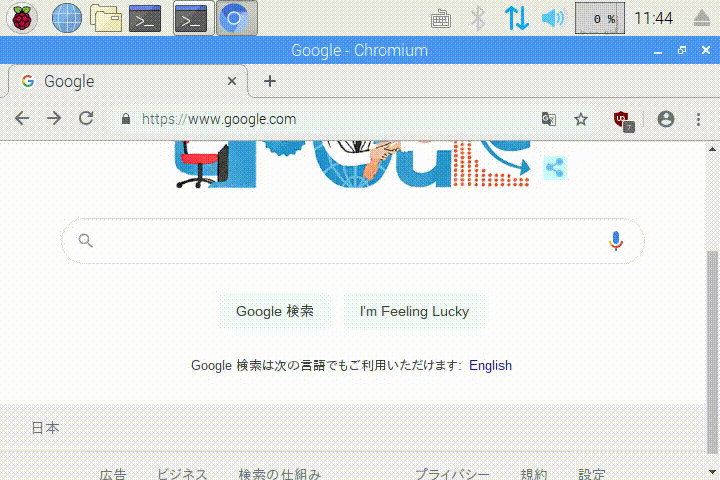

## はじめに

キオスク端末化した(フルスクリーンでアプリ起動。タッチ操作のみ)ラズパイで、オンスクリーンキーボードを使って日本語入力を行う方法の備忘録です。

<br/>

## 要件

* アプリはhtml+javascriptで、chromium-browserのkioskモードで起動する
* テキストボックスにフォーカスするとオンスクリーンキーボードが出て、フォーカスを外すとキーボードが消えてほしい
* デフォルトがローマ字入力モードで、変換も可能にしたい
* タッチスクリーンのみで操作

<br/>

## 手順

### 1. matchbox-keyboardをインストールする

aptでインストールするとバージョンが古くdaemonモードが使えないため、githubのソースコードからインストールします。
xmlファイルでレイアウトを変更することもできるので、キオスク端末に適しています。

```
sudo apt update
sudo apt upgrade
sudo apt install -y autoconf automake libtool
sudo apt install -y libfakekey-dev libmatchbox-dev
git clone https://github.com/xlab/matchbox-keyboard
cd matchbox-keyboard
autoreconf -v --install
./configure
make
sudo make install
sudo apt install -y fonts-takao
```

<br/>

※ 文字化けしたのでフォントもインストールしています。

<br/>

インストールしたら以下のコマンドでオンスクリーンキーボードが出せます。
```
matchbox-keyboard
```

<br/>

### 2. fcitx-mozc をインストールする

[Fcitx](https://fcitx-im.org/wiki/Fcitx)は文字入力の制御ソフト(インプットメソッドフレームワーク)です。
fcitx-mozcはそれの日本語変換エンジンらしいです。
ラズパイには最初から入ってるかも？

```
sudo apt install -y fcitx fcitx-mozc
im-config -n fcitx
sudo reboot
```

<br/>

\[設定\]→\[Fcitx 設定\]の\[入力メソッド\]タブでMozcを追加し、優先順位を矢印で上に変更するとデフォルトがローマ字入力になる。

<br/>

### 3. fcitx-matchbox-keyboard-toggler をインストールする

[fcitx-matchbox-keyboard-toggler](https://github.com/gyojir/fcitx-matchbox-keyboard-toggler)
は自作のFcitxアドオンです。
Fcitxの入力イベントにフックすることで、入力フォーカスの切り替わりでmatchbox-keyboardをオンオフできます。

matchbox-keyboardのオンオフは以下の実装を参考にしています。<br/>
https://github.com/xlab/matchbox-keyboard/tree/matchbox-keyboard-xlab/gtk-im<br/>
これを使ってもmatchbox-keyboardの自動オンオフは可能になりますが、gtk専用インプットメソッドとして実装されているため、
インプットメソッドであるFcitxと競合してしまいます。

インストール手順は以下の通り

```
sudo apt install -y fcitx-libs-dev libx11-dev cmake
git clone https://github.com/gyojir/fcitx-matchbox-keyboard-toggler
cd fcitx-matchbox-keyboard-toggler
mkdir build
cd build
cmake ..
make
sudo make install
sudo reboot
```

<br/>

アドオンが有効になっているかの確認は以下のコマンドで、有効なアドオンの一覧に"fcitx-matchbox-keyboard-toggler"が出ているかどうかを見れば分かります。
```
fcitx-diagnose
```

<br/>

後はmatchbox-keyboardをdaemonモードで起動するだけです。
```
matchbox-keyboard -d
```

<br/>
<br/>



<br/>

## キオスクモードについてメモ

### 起動時をデスクトップ→CLIに変更

```
sudo raspi-config
```
でメニューが出たら\[Boot Options\]→\[Desktop / CLI\]を"Console Autologin"に変更。

<br/>

### matchbox-window-manager をインストール

デスクトップを無効にするとアプリのウィンドウを管理する人が居なくなってしまうので、ウィンドウマネージャを使う。

```
sudo apt install matchbox-window-manager
```

<br/>

### アプリの自動起動

Xorg(Xサーバー)のパーミッション設定。

```
sudo chmod u+s /usr/lib/xorg/Xorg
```

<br/>

起動時に呼び出すスクリプトを作成。

```
tee /home/pi/kiosk.sh <<EOF
#!/bin/sh

xset s off
xset -dpms

export QT_IM_MODULE=fcitx
export GTK_IM_MODULE=fcitx
export XMODIFIERS=@im=fcitx

fcitx

matchbox-window-manager -use_cursor no -use_titlebar no &
matchbox-keyboard -d &
chromium-browser --noerrdialogs --disable-infobars --touch-devices=6 --kiosk http://example.com
EOF
```

<br/>

流れは以下の通り
1. スクリーンセーバー設定
    * `xset s off` : スクリーンセーバーオフ
    * `xset -dpms` : 省電力設定オフ
1. インプットメソッドにfcitxを設定
1. fcitxを起動
1. ウィンドウマネージャ起動
1. matchbox-keybaordをdaemonモードで起動
1. chromium-browserを起動
    * 環境によってはchromium-browserではなくchromiumかもしれない。
    * `--noerrdialogs` : エラーダイアログを抑制
    * `--disable-infobars` : 情報バー?を無効にする。最新のchromiumではこのオプションは使えないらしいので無くてもいいかも
    * `--touch-devices=6` : xinput listでタッチパネルの番号を確認して入れる
    * `--kiosk` : キオスクモード(全画面)

<br/>

以下の様にサービスを追加する。

```
sudo tee /etc/systemd/system/kiosk.service <<EOF
[Unit]
Description=Kiosk service
After=network-online.target
[Service]
Environment=DISPLAY=:0.0
Environment=XAUTHORITY=/home/pi/.Xauthority
Type=simple
ExecStart=/usr/bin/xinit /home/pi/kiosk.sh -- -nocursor
Restart=on-abort
User=pi
Group=pi
[Install]
WantedBy=multi-user.target
EOF

sudo systemctl enable kiosk
```

<br/>
