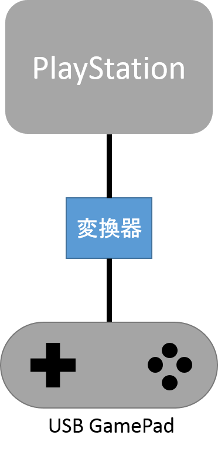

記事一覧
- [その1（調査編）](/2019/01/20/mmx5El0Si)　←ココ
- [その2（USB編）](/2019/01/21/2stNWIQ7Z)
- [その3（Nucleo編）](/2019/02/17/vORCOiXb_)
- [その4（ケーブル編）](/2019/02/17/2fluV8sa5)
- [その5（最終章）](/2019/02/17/kuG0eT691)

# 背景
PlayStation(以下PS1)の雷電をやってたら親指が痛くなったので、アケコンが欲しくなった。
ただPS1用のアケコンを今更買ってもPS1でしか使えないし、もう生産されてないし、なんか嫌だったので、USBゲームパッドをPS1で使えるようにする変換器を買おうと思った。

しかし、PSコン→USBの変換器はあるものの、USB→PSの変換器は無かった(2019/01/20 現在)。ので作ることにした。

イメージとしては↓こんな感じ

ちなみに記事タイトルのPSXというのは英語圏での呼び方？っぽい。  
 （Sonyは日本ではPSXという名前でPS2互換のDVDレコーダーを出していたらしい。ややこしい）

# 調査
そもそもPS1はどうやってコントローラーと通信しているのか？  
調べるといくつか良さげなページが見つかる（[ココ](https://gamesx.com/controldata/psxcont/psxcont.htm)とか[ココ](https://www.electro-tech-online.com/threads/using-a-pic-to-emulate-a-psx-controller.29611)とか）  

どうやらSPI通信を使っているらしい。  
詳しくは上に挙げたページを見てもらうこととして、ざっくり説明すると  
- 通信はSPI通信  
- 各信号線名をSPIでの用語に置き換えると
  - DATA		= MISO（マスターイン スレーブアウト）
  - COMMAND	= MOSI（マスターアウト スレーブイン)
  - ATT		= SS（スレーブセレクト）
  - CLOCK 	= SCK（クロック）
- 通常のSPIに加えて、ACK信号によって通信を制御している。
  - 1バイトのデータ送受信ごとにスレーブ側（コントローラー）がACKを少なくとも1クロック分（約2us）　LOWにする必要がある。
- オーダーはLSB（一般的なSPI通信はMSB）
- CPOL = 1、CPHA = 1（MODE3）  
　→つまりクロックはアイドル状態でHIGH、クロックの立ち上がりでデータ読み込み

### 通信例（デジタルコントローラーの場合）  
1. PSから[0x01：start command]を受信。  
1. コントローラーはACKを一瞬LOWに  
1. PSから[0x42：request the data]を受信、  
1. 同時にコントローラーからID[0x41：digital]を送信。（アナログコントローラーなら0x73）  
1. ACK  
1. コントローラーから[0x5A]を送信。  
1. ACK  
1. コントローラーからボタン情報（1バイト目）を送信。  
1. ACK  
1. コントローラーからボタン情報（2バイト目）を送信。  

…ということだそう。  
 
 
つづく。  