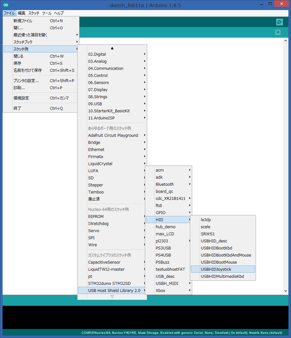

記事一覧
- [その1（調査編）](/2019/01/20/mmx5El0Si)
- [その2（USB編）](/2019/01/21/2stNWIQ7Z)　←ココ
- [その3（Nucleo編）](/2019/02/17/vORCOiXb_)
- [その4（ケーブル編）](/2019/02/17/2fluV8sa5)
- [その5（最終章）](/2019/02/17/kuG0eT691)

# USBゲームパッド読み込み

Arduino用のUSBホストシールドを購入。  
Arduino IDEで[USB Host Shield Library 2.0](https://www.arduinolibraries.info/libraries/usb-host-shield-library-2-0)をインストール。サンプルのUSBHIDJoystickを使ってみる。

 

 

手持ちのゲームパッドJC-U3613Mをつなげると反応はするが、ボタンと表示が合わなかった。  
プログラムを見てみると、何バイト目がボタン、何バイト目がジョイスティックという具合に決め打ちになっていた。  
これを手持ちのゲームパッドに合わせて設定するということもできるけど、それだと違うゲームパッドを使いたくなったときに困るし、新しく対応するたびに何バイト目がボタンで…とかやるのはとてもダサい。  

ということで、もっとスマートな方法が無いか調べた。  

# HID / Report Descriptor

USBのゲームパッドはHID(Human Interface Device)である。  
HIDについてはいくらでも情報があると思うので特に説明はしないけど、ここで重要なキーワードが出てくる。  

## Report Descriptor

簡単に説明すると、HIDはそれぞれデバイスごとにReport Descriptorというモノを定義していて、そこに、何バイト目から何ビットがボタンで、何バイト目がジョイスティックのX軸で、何バイト目がハットスイッチで…みたいな情報が入っている。  
こう書くと簡単そうだけど結構分かりにくくて、ちょっとしたスクリプトのような形式になっている。  
そいつを上から順番にパースしていくことで情報が取得できる。基本的には変数のようなものに入力/出力の特性（例えばボタン、スティックのX軸といった種類、ビット数、最大値最小値、etc...）を格納して、Input/Outputアイテムによってその時点で格納されている情報を入力/出力として登録…という流れになっている。  
Report Descriptorについてもっと詳しく知りたければ、[コチラ](http://wiki.onakasuita.org/pukiwiki/?%E3%83%AC%E3%83%9D%E3%83%BC%E3%83%88%E3%83%87%E3%82%A3%E3%82%B9%E3%82%AF%E3%83%AA%E3%83%97%E3%82%BF)のページが分かりやすいのでお勧め。  

てなわけで、Report Descriptorを使えばスマートにデータが取得できそう。ということが分かった。  

## Report Descriptorのパース

何やら面倒くさそうだけど、実はさっきの[USB Host Shield Library 2.0](https://www.arduinolibraries.info/libraries/usb-host-shield-library-2-0)にはUSBHID\_descというモロにストライクなサンプルがある。  
とにかくこいつを使って手持ちのゲームパッドを読み込んでみたところ、どうやらバグっていた。ので直して[プルリク](https://github.com/felis/USB_Host_Shield_2.0/pull/438)してみた。  
修正内容は以下の通り。

- グローバルアイテムをメインアイテムの後にリセットしないよう修正
- トグルエラー発生時の処理を修正
  - これを直すとロジクールのF310が動くようになった  
-  ビットの読み込みバグ修正  

まあ、間違ってるかもだしプルリクの作法もよく分からないけど、あとはあっちで良しなにやってくれると信じよう。  

とりあえず、USBゲームパッドは読み込めるようになった。  
 
 
つづく。