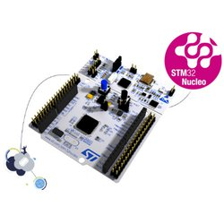
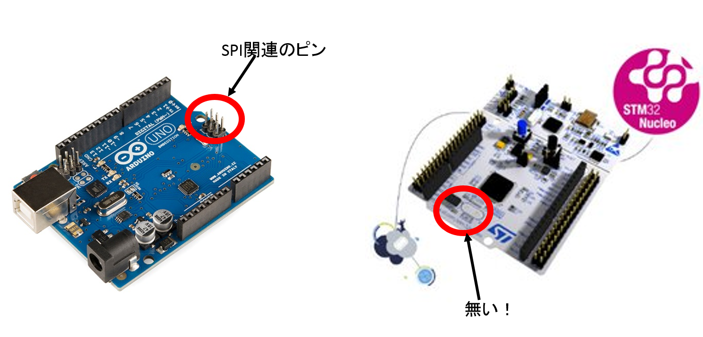
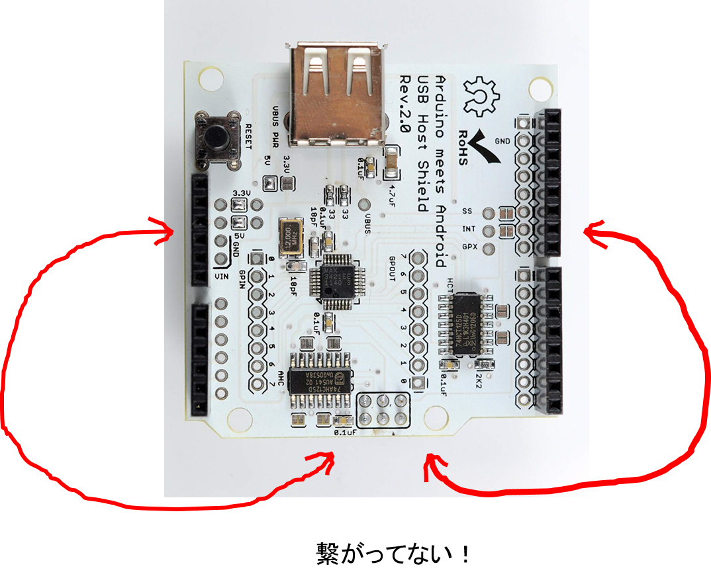
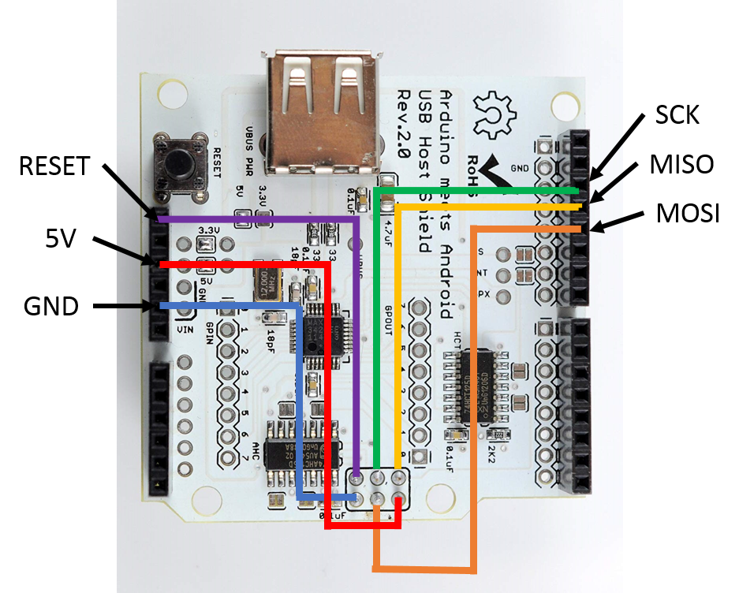
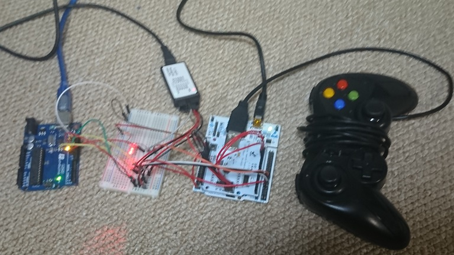
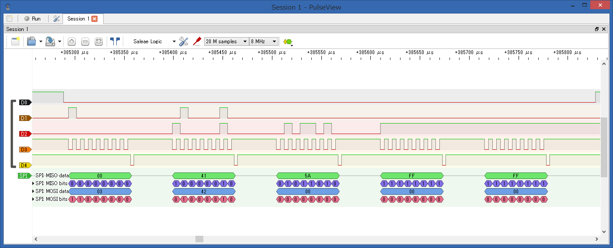

記事一覧
- [その1（調査編）](/2019/01/20/mmx5El0Si)
- [その2（USB編）](/2019/01/21/2stNWIQ7Z)
- [その3（Nucleo編）](/2019/02/17/vORCOiXb_)　←ココ
- [その4（ケーブル編）](/2019/02/17/2fluV8sa5)
- [その5（最終章）](/2019/02/17/kuG0eT691)

# PS1と接続…の前に
Arduino⇔ゲームパッドができたので、後はPS1とArduinoで通信すれば完成だ！と思ったのだけど、ここで問題が発生。
PS1との通信はSPI通信で、USBホストシールドとArduinoの通信もSPI通信。Arduino UNOにはSPI通信ポートが一つしかないので両方同時に行うのは不可能だった。どちらもArduinoがマスター側なら問題ないのだけど、PS1との通信ではPS1がマスターなので…

そこで以下の案を考えた  
1. PS1⇔Arduino⇐(SPI以外の通信)⇒Arduino⇔ゲームパッド
2. SPIを複数使えるマイコン

1.の案はできそうではあるけど何かダサくて嫌だったので、2.の案をメインに考えた。  
すると！丁度持ってました。STM32 NUCLEO-F401RE です。



こちら2000円くらいで買えるSTM32F4マイコンの評価ボードで、mbed開発環境で使えたり、オンチップデバッガが使えたり、Arduino互換ピンを持っていたり、SPI通信ポートが3つもあったりしてかなり高性能。今回の目的にドンピシャだった。

というわけでNUCLEO-F401REを使うことに決定。

## 開発環境
Nucleoで開発するときはmbedが楽なのだけど、今回は元々Arduinoで作っていたし、[USB Host Shield Library 2.0](https://www.arduinolibraries.info/libraries/usb-host-shield-library-2-0) がArduino用のライブラリだったこともありArduino開発環境で開発をすることにした。  

Arduino開発環境でNucleo使うにはstm32duinoというのを導入するんだけど、それは[stm32duinoのgithub](https://github.com/stm32duino/Arduino_Core_STM32#getting-started)とか[このへん](https://www.denshi.club/pc/nucleo/nucleoarduino1blink.html)を参考にするとできる。  

加えて、Arduino開発環境を使う必要があるけど、Arduino IDEは使い辛くて嫌になったのでVS Codeを使うことにした。VS Codeの拡張機能で[Arduino](https://marketplace.visualstudio.com/items?itemName=vsciot-vscode.vscode-arduino)と[C++](https://marketplace.visualstudio.com/items?itemName=ms-vscode.cpptools)のやつを入れればコード補間も効くし最高。さらに[このへん](http://kunukunu.hatenablog.com/entry/2018/05/06/190509)を参考にしてデバッガも使えるようにした。この辺りは今度別記事で書くかもしれない。  

# Nucleo⇔USBゲームパッド
USBホストシールドはNucleoの互換ピンに直接挿せるのだけど、そのままでは動かない。Arduino UnoではSPI関連のピンをまとめたピンが出ているけど、Nucleoにはそれが無い。USBホストシールドはそのピンを使っていて、周りについているArduinoピンソケットにもつながれていなかった。






ということで、Nucleoで使うにはそれとピンソケットをジャンパ線でつないでやる必要がある。



こんな感じで。

これだけではまだ使えなくて、F401xx対応のためには USB Host Shield Library 2.0 のプログラムも少しいじる必要がある。といっても[こんな感じ](https://github.com/gyojir/USB_Host_Shield_2.0/commit/9a9a8c252c279a36e890fcd623b045195bfed485#diff-4e876da24e2593a74949bb01d23146d8)でdefineに少し書き加えるだけだけど。

これでArduinoと同じようにUSBホストシールドが使えるようになった。

# NucleoのSPI通信設定
stm32のプログラムは少し癖があって、GPIOを使ったりSPI通信をするにはHALライブラリというのをごにょごにょする必要がある。多分stm32duinoでラップされているとは思うけど。

スレーブ側（PS1とのSPI通信）設定は以下のような感じになる。

```cpp
#define MOSI_PIN GPIO_PIN_15
#define MISO_PIN GPIO_PIN_14
#define SCK_PIN GPIO_PIN_13
#define SS_PIN GPIO_PIN_12
#define ACK_PIN GPIO_PIN_1

void SPI_Slave_Init(void)
{
    __GPIOB_CLK_ENABLE();
    __SPI2_CLK_ENABLE();

    // ---------------------------------------------------
    // SPIの設定
    // ---------------------------------------------------
    SPI_Slave_Handle.Instance = SPI2;
    SPI_Slave_Handle.Init.Mode = SPI_MODE_SLAVE;
    SPI_Slave_Handle.Init.Direction = SPI_DIRECTION_2LINES;
    SPI_Slave_Handle.Init.DataSize = SPI_DATASIZE_8BIT;
    SPI_Slave_Handle.Init.CLKPolarity = SPI_POLARITY_HIGH;
    SPI_Slave_Handle.Init.CLKPhase = SPI_PHASE_2EDGE;
    SPI_Slave_Handle.Init.NSS = SPI_NSS_SOFT;
    SPI_Slave_Handle.Init.FirstBit = SPI_FIRSTBIT_LSB;
    SPI_Slave_Handle.Init.TIMode = SPI_TIMODE_DISABLED;
    SPI_Slave_Handle.Init.CRCCalculation = SPI_CRCCALCULATION_DISABLED;
    SPI_Slave_Handle.Init.CRCPolynomial = 10;
    HAL_SPI_Init(&SPI_Slave_Handle);

    // ---------------------------------------------------
    // MISO, MOSI, SCK, SSの設定
    // ---------------------------------------------------
    GPIO_InitTypeDef GPIO_InitStruct;

    // MISO
    GPIO_InitStruct.Pin = MISO_PIN;
    GPIO_InitStruct.Mode = GPIO_MODE_AF_OD;    // Alternate function 出力
    GPIO_InitStruct.Pull = GPIO_NOPULL;        // プルアップ
    GPIO_InitStruct.Speed = GPIO_SPEED_HIGH;   // ハイスピード
    GPIO_InitStruct.Alternate = GPIO_AF5_SPI2; // Alternate function mappingを参照のこと
    HAL_GPIO_Init(GPIOB, &GPIO_InitStruct);

    // SCK, MOSI
    GPIO_InitStruct.Pin = SCK_PIN | MOSI_PIN;
    GPIO_InitStruct.Mode = GPIO_MODE_AF_OD; // Alternate function ドレイン
    GPIO_InitStruct.Pull = GPIO_PULLUP;     // プルアップ
    HAL_GPIO_Init(GPIOB, &GPIO_InitStruct);

    // SSの設定
    GPIO_InitStruct.Pin = SS_PIN;
    GPIO_InitStruct.Mode = GPIO_MODE_AF_OD; // Alternate function ドレイン
    GPIO_InitStruct.Pull = GPIO_PULLUP;     // プルアップ
    HAL_GPIO_Init(GPIOB, &GPIO_InitStruct);
    stm32_interrupt_enable(GPIOB, SS_PIN, SPI_isr_func, GPIO_MODE_IT_FALLING);
    HAL_NVIC_SetPriority(EXTI15_10_IRQn, 0, 0);
}
```

※stm32_interrupt_enableはstm32duinoでのGPIO割り込み設定。

ACKピンのGPIO設定も必要なので以下のようにする

```cpp
void GPIO_Init(void)
{
    // GPIO Ports Clock Enable
    __GPIOA_CLK_ENABLE();
    __GPIOB_CLK_ENABLE();
    __GPIOC_CLK_ENABLE();

    GPIO_InitTypeDef GPIO_InitStruct;
    GPIO_InitStruct.Pin = ACK_PIN;
    GPIO_InitStruct.Mode = GPIO_MODE_OUTPUT_OD;
    GPIO_InitStruct.Pull = GPIO_NOPULL;
    HAL_GPIO_Init(GPIOB, &GPIO_InitStruct);

    HAL_GPIO_WritePin(GPIOB, ACK_PIN, GPIO_PIN_SET);
}
```

マスター側（USBホストシールドとのSPI通信）設定は以下のような感じになる

```cpp
// SPI1 init function
void SPI_Master_Init(void)
{
    SPI_Handle.Instance = SPI1;
    SPI_Handle.Init.Mode = SPI_MODE_MASTER;
    SPI_Handle.Init.Direction = SPI_DIRECTION_2LINES;
    SPI_Handle.Init.DataSize = SPI_DATASIZE_8BIT;
    SPI_Handle.Init.CLKPolarity = SPI_POLARITY_LOW;
    SPI_Handle.Init.CLKPhase = SPI_PHASE_1EDGE;
    SPI_Handle.Init.NSS = SPI_NSS_SOFT;
    SPI_Handle.Init.BaudRatePrescaler = SPI_BAUDRATEPRESCALER_4;
    SPI_Handle.Init.FirstBit = SPI_FIRSTBIT_MSB;
    SPI_Handle.Init.TIMode = SPI_TIMODE_DISABLED;
    SPI_Handle.Init.CRCCalculation = SPI_CRCCALCULATION_DISABLED;
    SPI_Handle.Init.CRCPolynomial = 10;
    HAL_SPI_Init(&SPI_Handle);
}
```

プルアップの設定とかオープンドレインとかいまいち理解してないけど、とりあえずこれで通信できたので良しとする。

## NucleoとArduinoでPS1との通信を模倣
実際にPS1と通信する前に、ArduinoにPS1側の動作をやらせてみました。  
Arduino(PS1)側のコードは以下の通り。コイツと通信できれば多分OK？？(OKではなかったが意味はある)

```cpp
/**********************************************
  Arduino nano SPI(Master)
**********************************************/
#include <SPI.h>

#define SS_PIN 10
#define BUF_SIZE 256

static bool wait_ack(void);
static void PrintBin(uint8_t val);

void setup() {
  Serial.begin(9600);
  while (!Serial)

  pinMode(9, INPUT_PULLUP);

  pinMode(SS_PIN, OUTPUT);
  digitalWrite(SS_PIN, HIGH);    //SS
  
  SPI.setClockDivider(SPI_CLOCK_DIV32);  //fosc/128
  
  // SPI_MODE0(アイドル時のクロックがLow、立ち上がりでサンプリング)
  // SPI_MODE1(アイドル時のクロックがLow、立ち下がりでサンプリング)
  // SPI_MODE2(アイドル時のクロックがHigh、立ち下がりでサンプリング)
  // SPI_MODE3(アイドル時のクロックがHigh、立ち上がりでサンプリング)
  SPI.setDataMode(SPI_MODE3);

  SPI.setBitOrder(LSBFIRST);

  SPI.begin();    //SPI有効
  Serial.println("/-----START Arduino UNO-----/");
  Serial.println("/---------SPI Master--------/");
  Serial.println("/-------Default DIV128------/");
  delay(100);
}
void loop() {
  uint8_t rv;
  uint8_t data[2];

  digitalWrite(SS_PIN, LOW);    //SS 有効
  {
    SPI.transfer(0x01);    //送受信処理
    if(wait_ack()){

      rv = SPI.transfer(0x42);    //送受信処理
      if(wait_ack()){
        if(rv == 0x41){
          rv = SPI.transfer(0);    //送受信処理
          wait_ack();
          if(rv == 0x5A){
            rv = SPI.transfer(0);    //送受信処理
            if(wait_ack()){
              data[0] = rv;
              
              rv = SPI.transfer(0);    //送受信処理
              if(wait_ack()){
                data[1] = rv;
                for (int i = 0; i < 2; i++) {
                  PrintBin(data[i]);
                  Serial.println();
                }
              }
            }
          }        
        }
      }
    }
  }
  digitalWrite(SS_PIN, HIGH);   //SS 終了

  delay_us(100);
}

bool wait_ack(){
  int count = 0;

  // lowになるのを待つ
  while(PINB & _BV(PB1)){
    if(count++ > 5){
      return false;
    }
  }

  // highになるのを待つ
  while(!(PINB & _BV(PB1))){
    if(count++ > 1000){
      return false;
    }
  }
  return true;
}

void PrintBin(uint8_t val) {
  for(uint8_t mask = (((uint8_t)1) << ((sizeof (uint8_t) << 3) - 1)); mask; mask >>= 1)
    if(val & mask)
      Serial.print('1');
    else
      Serial.print('0');
}

void delay_us(uint32_t us){
  // 16MHz
  // 1clock = 1 / 16MHz = 6.25e-8s
  // 1us / 6.25e-8 = 16

  for(uint32_t i = 0; i < us; i++){
    asm("nop;nop;nop;nop;nop;nop;nop;nop;nop;nop;nop;nop;nop;nop;nop;nop;");
  }
}
```

<br>
<br>


実際につないだ様子  

900円くらいのロジアナにつないで、PulseViewというソフトで計測するとこんな感じになった。  



<br>

いい感じ！

これで、あとはPS1と実際に通信するだけ！  
<br>
<br>
つづく。
