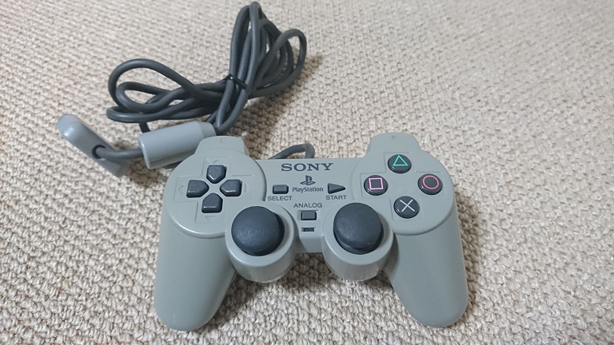
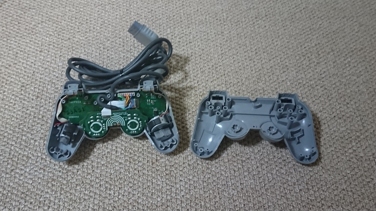
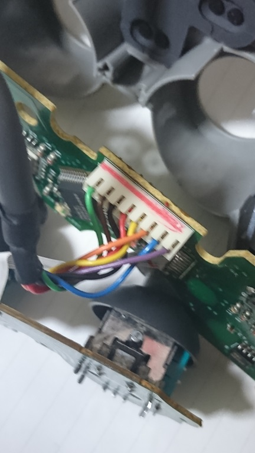
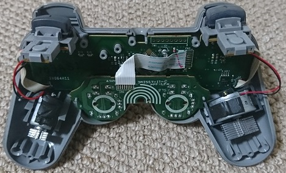
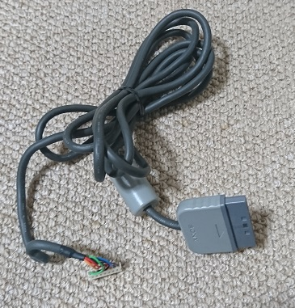
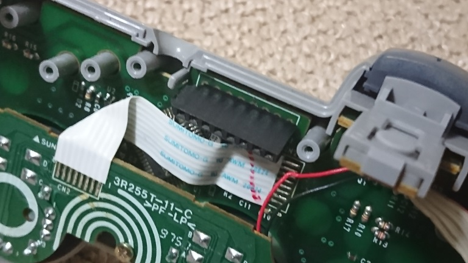
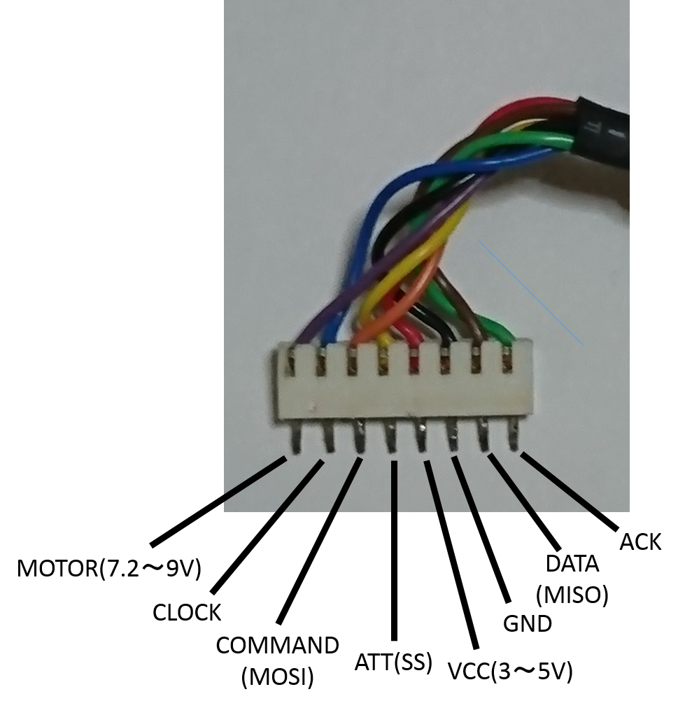

記事一覧
- [その1（調査編）](/posts/mmx5El0Si)
- [その2（USB編）](/posts/2stNWIQ7Z)
- [その3（Nucleo編）](/posts/vORCOiXb_)
- [その4（ケーブル編）](/posts/2fluV8sa5)　←ココ
- [その5（最終章）](/posts/kuG0eT691)

# 接続ケーブル作成
PS1とArduinoで接続するためにはケーブルが必要なので、中古でPS1コントローラーを買って、そいつからケーブルだけ拝借することにした。単純に考えればケーブルをちょん切るだけでいいのだけど、それでは面白くないのでひと手間かけてみた。

まずはコイツを

 

分解

 

ここで繋がっているので…

 

ここのはんだを剥がす！

 

摘出完了！

 

ついでにコントローラーにピンソケットを付けてみる

 

これで元のコントローラーに戻すこともできる！！  

各線はこんな感じになっている。

 
 
つづく。