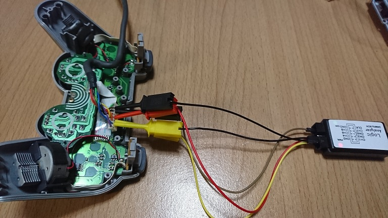
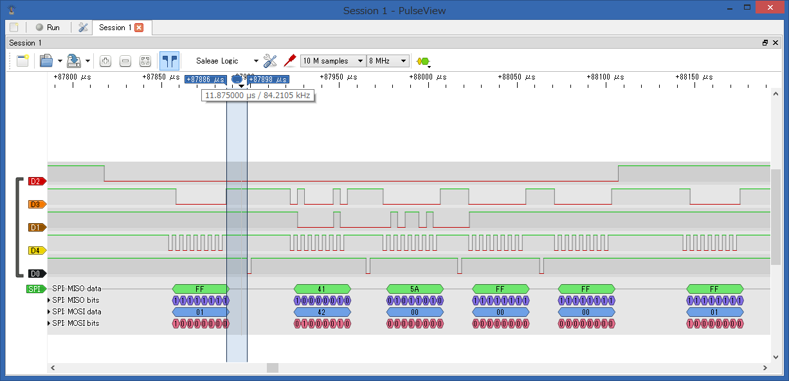
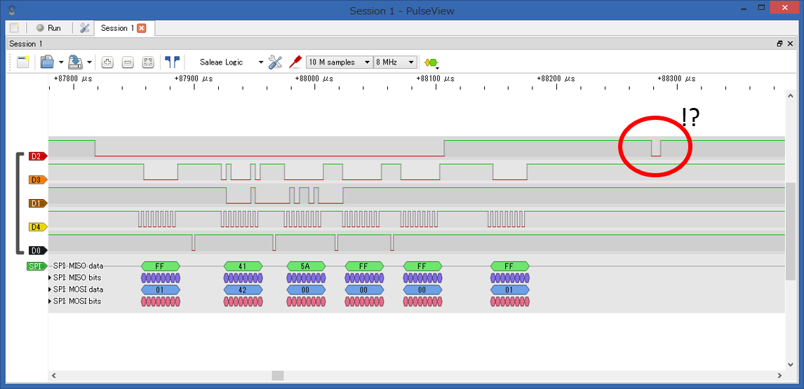
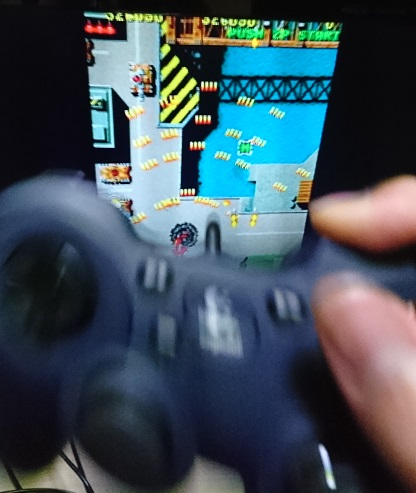
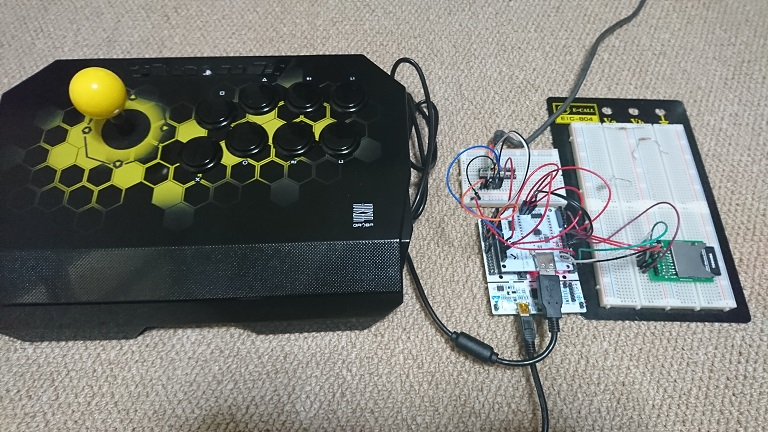
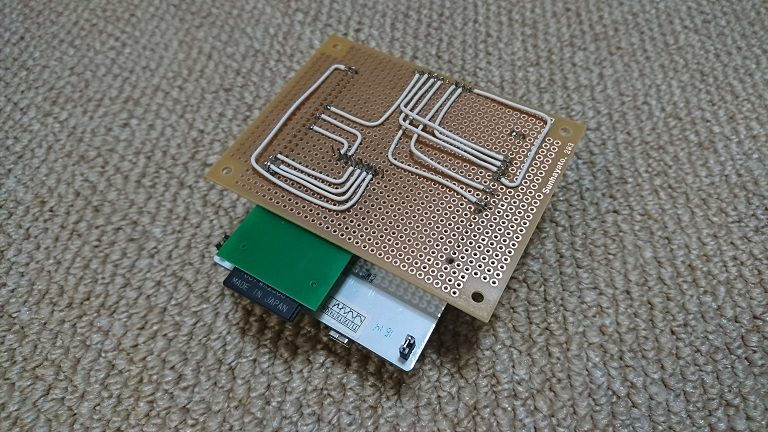
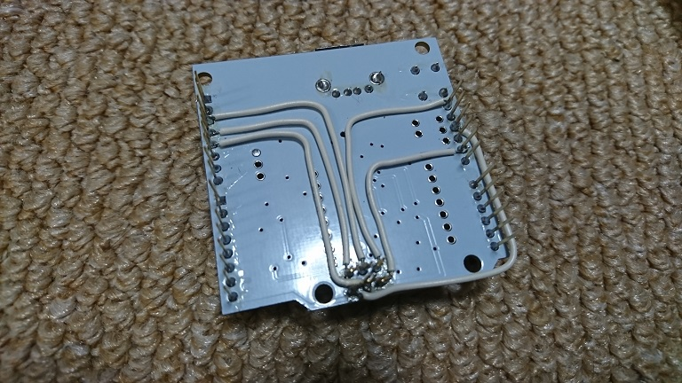
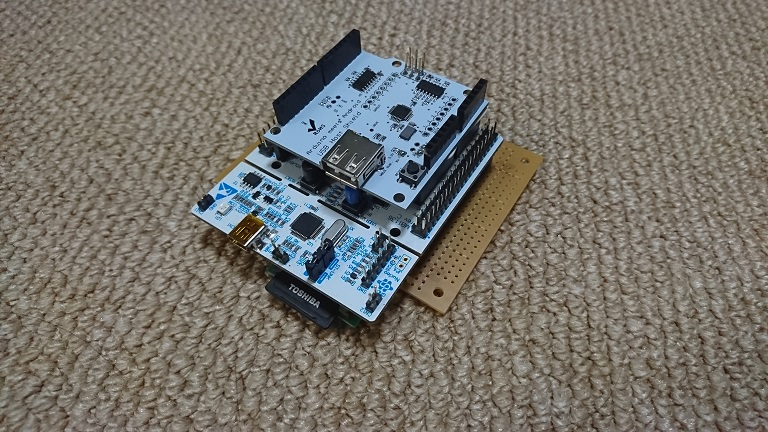
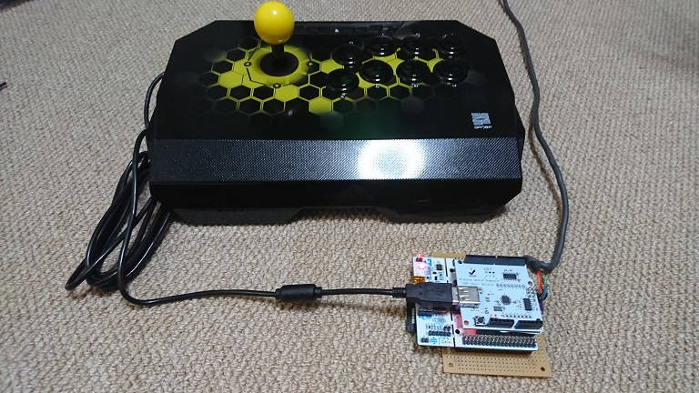

記事一覧
- [その1（調査編）](/2019/01/20/mmx5El0Si)
- [その2（USB編）](/2019/01/21/2stNWIQ7Z)
- [その3（Nucleo編）](/2019/02/17/vORCOiXb_)
- [その4（ケーブル編）](/2019/02/17/2fluV8sa5)
- [その5（最終章）](/2019/02/17/kuG0eT691)　←ココ
　
# PS1と通信
PS1につなぎ変えて、通信してみる……動かない。

色々調べたらいくつかの問題が発生していた。

## ACKタイミング問題
動かないのでPS1とPS1コントローラーの実際の通信をロジアナで確認。





ACKのタイミングがSPIの送受信後、数usしてから行われていた。送受信直後にACKしていたのでPS1が認識できていなかったらしい。ということで、10us待ってからACKするように修正。

## フェイントSS(ATT)問題
PS1とPS1コントローラーの実際の通信を見ていると、PSが謎のSS信号を一瞬出していることが分かった。



※SS信号が無いときにもMOSIが来ているが、これは2P用の信号

Nucleo側ではSSピンの立下りで割り込みをかけているので、これに引っかかって通信を開始してしまい不具合が起きていたようだ。ということで、割り込み後少し待ってからSSピンを確認してLOWだったら通信開始とするように修正。

## SPIバッファ問題
どうもよく分からないが、STM32F4ではSPI通信がズレた時にバッファにゴミが残ってしまい、次の通信に影響が出てしまうらしい。ということで、毎回通信後に\_\_HAL\_SPI\_DISABLE(&SPI\_Slave\_Handle);を呼び出してバッファクリアを行うことでなんとか解決した。

そのほかにもいくつか細かいことで詰まったが、上の3つがなかなか厄介だった。

# 通信成功！
PS版の雷電をUBSゲームパッドで遊ぶことに成功した。わーいわーい。  



# アケコン＋コンフィグ
本来の目的であるアケコンで遊ぶために、Qanba Droneというアケコンを買って繋いでみた。実はここでも躓いていて、なぜか受信するデータが1バイトずれて読み込まれてしまった。色々調べたけど結局原因はよく分かっていなくて、Qanba Droneにつなぐときは8bitオフセットをかけるという対処を行うことにした。  
プログラムをいちいち書き換えるのは面倒なのでSDカードで設定を行えるようにした。加えて、ゲームパッドごとにボタンの配置が違うため、それもSDカードで設定できるようにした。

コンフィグファイルはこんな感じ

```ini
OFFSET=0

[KEY_CONFIG]
O=3
X=2
TRI=1
SQUARE=0

L1=4
R1=5
L2=6
R2=7

SELECT=10
START=11
```




ちなみに、Qanba DroneはPS4モードで使う。

# 基板作成
ブレッドボードだとアレなので、基板も作った。

裏側


<br>

ホストシールドのジャンパも直接接続してみる。


<br>

完成！


<br>

イエーイ


<br>

一応プログラムは[コチラ](https://github.com/gyojir/UsbToPSXConverter)にのせときます。