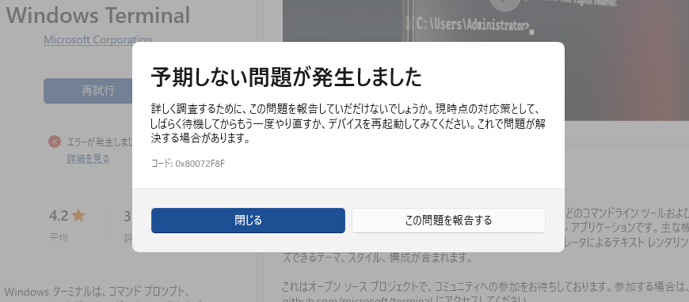
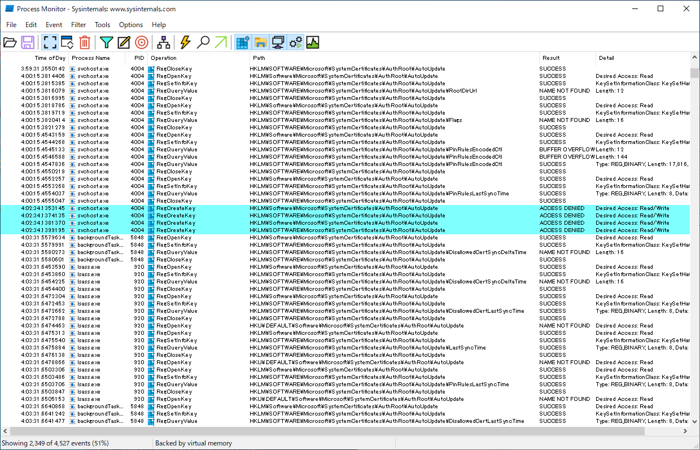

## はじめに

調子の悪くなった PC で Windows を再インストールした後、以下のような現象が発生しました。

* インターネットには普通にアクセス可能なのに Windows Update が「更新サービスに接続できませんでした。」というエラーを吐いて更新プログラムを取得できなくなった
* Microsoft Store もアプリをダウンロードしようとするとエラー 0x80072F8F が発生
* 証明書の失効チェックエラー 0x80092013 も発生(上記のエラーの原因)
* ネットで出てきた対処方法はどれも効果なしだった

なんとか解決したので備忘録として残しておきます。

<br/>

## 要約

*注意: レジストリの編集は自己責任でお願いします*

* レジストリの HKEY_LOCAL_MACHINE\SOFTWARE\Microsoft\SystemCertificates\AuthRoot\AutoUpdate\DisallowedCertLastSyncTime の値が古い(1日以上前)のが直接的な原因
* "Cryptographic Services" というサービスが DisallowedCertLastSyncTime の自動更新に失敗しているのが根本原因
* HKEY_LOCAL_MACHINE\SOFTWARE\Microsoft\SystemCertificates\AuthRoot\AutoUpdate のアクセス許可がおかしくなっていた
  * CryptSvc のアクセス許可が消えていた
* HKEY_LOCAL_MACHINE\SOFTWARE\Microsoft\SystemCertificates\AuthRoot\AutoUpdate のアクセス許可で継承を有効にして解決
* もしくは AutoUpdate キーを削除する(本当に消して問題ないのかは不明)

<br/>

## 調査記録

調査の流れを順を追って説明していきます。

### Windows Update エラー 0x80072F8F

Windowsの「設定」→「更新とセキュリティ」→「Windows Update」→「更新プログラムのチェック」を実行したら「更新サービスに接続できませんでした。」というエラーが発生しました。<br/>


<br/>

まずは原因を調べるためにPowershellで以下のコマンドを実行。

```
Get-WindowsUpdateLog
```

<br/>

デスクトップに吐き出されたWindowsUpdate.logを確認すると以下のようなエラーが出力されていました。

```
...
2023/03/21 22:19:01.4037009 19924 14968 SLS             Making request with URL HTTPS://slscr.update.microsoft.com/SLS/{9482F4B4-E343-43B6-B170-9A65BC822C77}/x64/10.0.19045.2728/0?CH=584&L=ja-JP;en-US&P=&PT=0x65&WUA=10.0.19041.2546&MK=LENOVO&MD=10120 and send SLS events.
2023/03/21 22:19:01.8143606 19924 14968 Misc            *FAILED* [80072F8F] Send request
2023/03/21 22:19:01.8143657 19924 14968 Misc            *FAILED* [80072F8F] WinHttp: SendRequestToServerForFileInformation (retrying with default proxy)
2023/03/21 22:19:02.2028507 19924 14968 Misc            *FAILED* [80072F8F] Send request
2023/03/21 22:19:02.2028576 19924 14968 Misc            *FAILED* [80072F8F] Library download error. Will retry. Retry Counter:0
2023/03/21 22:19:02.5952173 19924 14968 Misc            *FAILED* [80072F8F] Send request
2023/03/21 22:19:02.5952321 19924 14968 Misc            *FAILED* [80072F8F] WinHttp: SendRequestToServerForFileInformation (retrying with default proxy)
2023/03/21 22:19:02.9974552 19924 14968 Misc            *FAILED* [80072F8F] Send request
2023/03/21 22:19:02.9974797 19924 14968 Misc            *FAILED* [80072F8F] Library download error. Will retry. Retry Counter:1
2023/03/21 22:19:03.4057292 19924 14968 Misc            *FAILED* [80072F8F] Send request
2023/03/21 22:19:03.4057399 19924 14968 Misc            *FAILED* [80072F8F] WinHttp: SendRequestToServerForFileInformation (retrying with default proxy)
2023/03/21 22:19:03.8002051 19924 14968 Misc            *FAILED* [80072F8F] Send request
2023/03/21 22:19:03.8002199 19924 14968 Misc            *FAILED* [80072F8F] Library download error. Will retry. Retry Counter:2
2023/03/21 22:19:04.2043172 19924 14968 Misc            *FAILED* [80072F8F] Send request
2023/03/21 22:19:04.2043282 19924 14968 Misc            *FAILED* [80072F8F] WinHttp: SendRequestToServerForFileInformation (retrying with default proxy)
2023/03/21 22:19:04.5990215 19924 14968 Misc            *FAILED* [80072F8F] Send request
2023/03/21 22:19:04.5990314 19924 14968 SLS             Complete the request URL HTTPS://slscr.update.microsoft.com/SLS/{9482F4B4-E343-43B6-B170-9A65BC822C77}/x64/10.0.19045.2728/0?CH=584&L=ja-JP;en-US&P=&PT=0x65&WUA=10.0.19041.2546&MK=LENOVO&MD=10120 with [80072F8F] and http status code[0] and send SLS events.
2023/03/21 22:19:04.5990361 19924 14968 SLS             *FAILED* [80072F8F] GetDownloadedOnWeakSSLCert
2023/03/21 22:19:04.5991331 19924 14968 SLS             *FAILED* [80072F8F] Method failed [CSLSClient::GetResponse:625]
2023/03/21 22:19:04.5991367 19924 14968 Misc            *FAILED* [80072F8F] Method failed [CSLSEndpointProvider::GetWUClientData:2275]
2023/03/21 22:19:04.5991383 19924 14968 Misc            *FAILED* [80072F8F] EP: get client data
2023/03/21 22:19:04.5991397 19924 14968 Misc            *FAILED* [80072F8F] Method failed [CSLSEndpointProvider::GetSecondaryServicesEnabledState:1689]
2023/03/21 22:19:04.5991423 19924 14968 Agent           *FAILED* [80072F8F] Method failed [CAgentServiceManager::DetectAndToggleServiceState:2910]
2023/03/21 22:19:04.5991455 19924 14968 Agent           *FAILED* [80072F8F] Failed to resolve federated serviceId 855E8A7C-ECB4-4CA3-B045-1DFA50104289
2023/03/21 22:19:04.5991526 19924 14968 Agent           *FAILED* [80072F8F] Failed to execute service registration call {8AB60E13-99C0-4723-B11F-FBA5A0DB78E1} (cV: BtquFucK3Uq1349eI9rrLw.277.1.1.0.1)
...
```

<br/>

どうやら 0x80072F8F というエラーが発生しているようです。<br/>
<br/>
また、Microsoft Store でも同様にアプリのダウンロードでエラー 0x80072F8F が発生しました。



<br/>

0x80072F8F はエラーの種類を表す下位16bitが 2F8F(12175) なので、ERROR_WINHTTP_SECURE_FAILURE であることが分かります。
これでhttps通信の証明書関連のエラーであることが判明しました。<br/>
(参照: https://learn.microsoft.com/en-us/windows/win32/winhttp/error-messages#ERROR_WINHTTP_SECURE_FAILURE)

ちなみに、このエラーは PC の時刻設定がズレていると起きるらしいのですが時刻は合っていました。

### 証明書失効チェックエラー CRYPT_E_REVOCATION_OFFLINE (0x80092013)

試しに log にあった HTTPS://slscr.update.microsoft.com/ に curl してみると、証明書の失効チェックエラー CRYPT_E_REVOCATION_OFFLINE (0x80092013) が発生しました。
ということで 0x80072F8F は内部的にこれと同じエラーが発生していることが予想されます。

```
curl: (35) schannel: next InitializeSecurityContext failed: Unknown error (0x80092013) - 失効サーバーがオフラインのため、失効の関数は失効を確認できませんでした。
```

(ちなみに curl の InitializeSecurityContext は lsass.exe に対して MS-RPC (LPC) で sspisrv.dll!SspirProcessSecurityContext を呼び出しており、
その中で CRYPT32.dll!CertVerifyCertificateChainPolicy によって証明書のチェックを行っています。)
<br/>

OpenSSLで証明書チェーンを確認すると、中間証明機関が Microsoft ECC Update Secure Server CA 2.1、ルート証明機関が Microsoft ECC Product Root Certificate Authority 2018 であることが分かります。

```
openssl s_client -connect slscr.update.microsoft.com:443  -showcerts
```

<br/>

他のPCでは普通に Windows Update に接続できていることからも分かっていましたが、証明書が期限切れになっていたり、
CDP(CRL Distribution Point: 証明書失効リスト配布ポイント)がオフラインになっているということはありませんでした。

また、エクスポートした Microsoft ECC Update Secure Server CA 2.1.cer に対して、
certutil を実行してみると 0x80092013 と CERT_TRUST_REVOCATION_STATUS_UNKNOWN、CERT_TRUST_IS_OFFLINE_REVOCATION が出力されていました。

```
certutil -v -urlfetch -verify '.\Microsoft ECC Update Secure Server CA 2.1.cer'
```

```
...
SimpleChain.dwErrorStatus = CERT_TRUST_REVOCATION_STATUS_UNKNOWN (0x40)
SimpleChain.dwErrorStatus = CERT_TRUST_IS_OFFLINE_REVOCATION (0x1000000)
...
失効サーバーがオフラインのため、失効の関数は失効を確認できませんでした。 0x80092013 (-2146885613 CRYPT_E_REVOCATION_OFFLINE)
```

<br/>

### エラーの出所

エラーコードからはこれ以上情報が得られそうに無かったので、0x80092013 エラーの出所を直接調べることにしました。<br />
証明書のチェックを行うプログラムを作成し、デバッガでいつエラーが発生するのかを確認しました。(多分 certutil と同じようなことをしてるので作る必要は無いのですが…)

```cpp
#include <Windows.h>
#include <stdio.h>

#pragma comment(lib, "Crypt32.lib")

int main()
{
    HCRYPTPROV hProv;
    HCERTSTORE hStore;

    if (!CryptAcquireContext(&hProv, NULL, NULL, PROV_RSA_FULL, NULL))
    {
        if (!CryptAcquireContext(&hProv, NULL, NULL, PROV_RSA_FULL, CRYPT_NEWKEYSET))
        {
            return 1;
        }
    }

    hStore = CertOpenSystemStore(hProv, "CA");
    if (!hStore)
    {
        return 1;
    }

    PCCERT_CONTEXT pcCert;
    pcCert = CertFindCertificateInStore(
        hStore,
        PKCS_7_ASN_ENCODING | X509_ASN_ENCODING,
        0,
        CERT_FIND_SUBJECT_STR,
        L"Microsoft ECC Update Secure Server CA 2.1",
        NULL);

    if (!pcCert)
    {
        CertCloseStore(hStore, 0);
        CryptReleaseContext(hProv, 0);
        return 1;
    }

    HCERTCHAINENGINE hCertChainEngine = NULL;
    CERT_CHAIN_PARA chainPara;
    PCCERT_CHAIN_CONTEXT pcChainContext = NULL;
    memset(&chainPara, 0, sizeof(chainPara));
    chainPara.cbSize = sizeof(chainPara);

    if (!CertGetCertificateChain(
        hCertChainEngine,
        pcCert,
        NULL,
        NULL,
        &chainPara,
        CERT_CHAIN_REVOCATION_CHECK_CHAIN,
        NULL,
        &pcChainContext))
    {
        CertFreeCertificateContext(pcCert);
        CertCloseStore(hStore, 0);
        CryptReleaseContext(hProv, 0);
        return 1;
    }

    CERT_CHAIN_POLICY_PARA chainPolicyPara;
    CERT_CHAIN_POLICY_STATUS chainPolicyStatus;
    memset(&chainPolicyPara, 0, sizeof(chainPolicyPara));
    chainPolicyPara.cbSize = sizeof(chainPolicyPara);
    memset(&chainPolicyStatus, 0, sizeof(chainPolicyStatus));
    chainPolicyStatus.cbSize = sizeof(chainPolicyStatus);

    if (CertVerifyCertificateChainPolicy(
        CERT_CHAIN_POLICY_SSL,
        pcChainContext,
        &chainPolicyPara,
        &chainPolicyStatus))
    {
        printf("Error = %x\n", chainPolicyStatus.dwError);
    }

    CertFreeCertificateChain(pcChainContext);
    CertFreeCertificateContext(pcCert);
    CertCloseStore(hStore, 0);
    CryptReleaseContext(hProv, 0);

    return 0;
}
```

<br/>

このプログラムを実行すると```Error = 80092013```と出力されますが、元をたどっていくと CertGetCertificateChain の出力の pcChainContext->TrustStatus.dwErrorStatus に 0x1000040 (CERT_TRUST_REVOCATION_STATUS_UNKNOWN | CERT_TRUST_IS_OFFLINE_REVOCATION) が入っていることが分かります。

CertGetCertificateChain の内部を逆アセンブリで地道に追っていったところ、CRYPT32.dll!CCertChainEngine::GetTimeValidDisallowedCertAutoUpdateCtl
という関数が、「何らかの時刻」と「現在時刻」が24時間以上ズレていないかを判定していることが分かりました。
そしてその「何らかの時刻」というのがレジストリの HKEY_LOCAL_MACHINE\SOFTWARE\Microsoft\SystemCertificates\AuthRoot\AutoUpdate\DisallowedCertLastSyncTime だったわけです。(CRYPT32.dll!I_CertGetAutoUpdateLastSyncTime で HKEY_CURRENT_USER\SOFTWARE\Microsoft\SystemCertificates\AuthRoot\AutoUpdate\DisallowedCertLastSyncTime と比較して新しい方が使われる)

実際に DisallowedCertLastSyncTime の値をレジストリエディターで確認してみると、確かに1週間前くらいの時刻になっていました(Win32 FILETIME形式)。
そして、これを現在時刻に書き換えてみると Windows Update のエラーが解消しました。

### AutoUpdate の更新エラー

これで解決かと思ったのですが、1日経つと再び同じエラーが発生するようになりました。
どうやら DisallowedCertLastSyncTime の自動更新が上手く動いていないようです。

そこで Sysinternals の [Process Monitor](https://learn.microsoft.com/ja-jp/sysinternals/downloads/procmon) で確認したところ、時々
Cryptographic Services (svchost.exe) の HKEY_LOCAL_MACHINE\SOFTWARE\Microsoft\SystemCertificates\AuthRoot\AutoUpdate に対する RegCreateKey が ACCESS DENIED で失敗していることが分かりました。



<br/>

レジストリエディターで AutoUpdate のアクセス許可を確認してみると、アクセス許可の継承が無効になっていて CryptSvc のアクセス許可がされていませんでした。
ということでアクセス許可の継承を有効にすると RegCreateKey が成功し、DisallowedCertLastSyncTime の自動更新が動くようになり、エラーが解決しました。

## エラーの再現手順

手元でエラーを再現したい人のために再現手順を書いておきます。

* HKEY_LOCAL_MACHINE\SOFTWARE\Microsoft\SystemCertificates\AuthRoot\AutoUpdate のアクセス許可の継承を無効にし、CryptSvc のアクセス許可を削除する
* HKEY_LOCAL_MACHINE\SOFTWARE\Microsoft\SystemCertificates\AuthRoot\AutoUpdate\DisallowedCertLastSyncTime を適当に過去の時間にする
* HKEY_CURRENT_USER\SOFTWARE\Microsoft\SystemCertificates\AuthRoot\AutoUpdate\DisallowedCertLastSyncTime を適当に過去の時間にする
* キャッシュが残っていると再現しないので %SystemRoot%\SoftwareDistribution を削除する
```
net stop usosvc
net stop dosvc
net stop wuauserv
net stop bits
move %SystemRoot%\SoftwareDistribution %SystemRoot%\SoftwareDistribution.old
net start bits
net start wuauserv
net start dosvc
net start usosvc
```

<br/>

## 終わりに

いろいろと勉強になりました。
